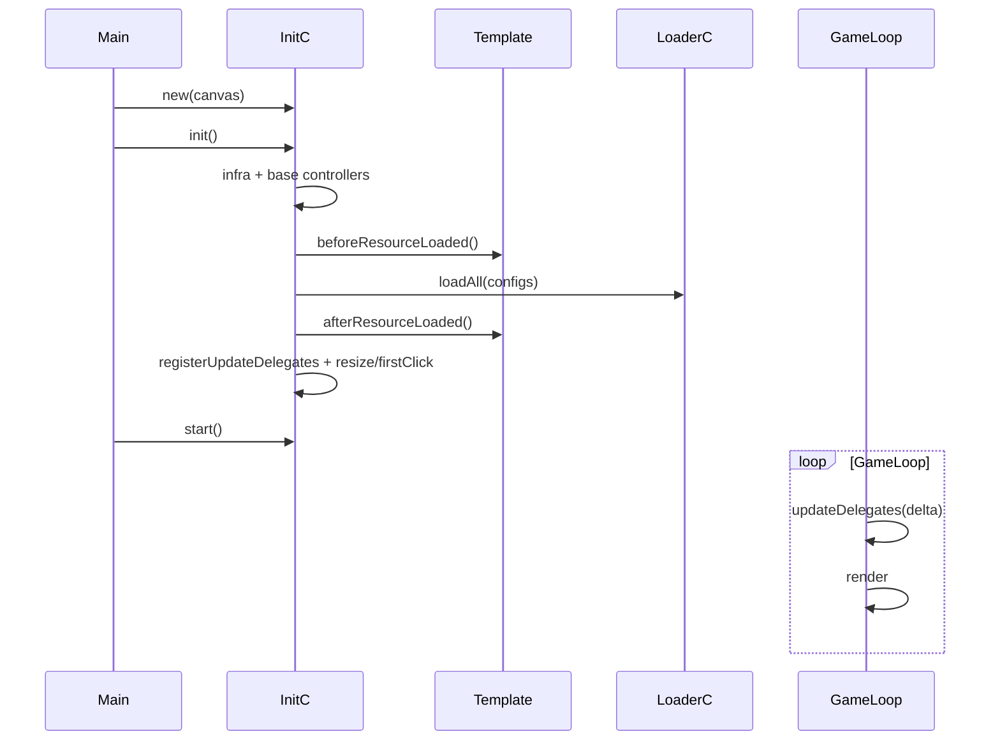

# Архітектура Three.js Engine Template

Цей документ описує **цільову** структуру проєкту: мінімальний базовий шар, система ресурсів, template callbacks і організоване оновлення через `updateDelegate`.

---

## 1. Принципи

| Шар | Призначення |
|-----|-------------|
| **Базовий (`core/`)** | Мінімум для старту: сцена, камера, фізика, інпут, завантаження ресурсів |
| **Template (`template/`)** | Кастомна логіка гри через callbacks — без роздування `InitC` |
| **Config (`config/`)** | Дані (камера, ресурси); контроллери — поведінка |

**Правило:** `InitC` лише збирає контроллери і запускає lifecycle. Orbit, світло, debug, demo-сцена — у `afterResourceLoaded` або game-модулях.

---

## 2. Структура папок

```text
src/
  main.ts
  types/core.ts
  config/
    engine.config.ts
    camera.config.ts
    resources/
      music.resources.ts
      meshes.resources.ts
      images.resources.ts
      textures.resources.ts
      vfx.resources.ts
      index.ts
  core/
    init/InitC.ts
    loop/GameLoopC.ts, TimeC.ts
    scene/SceneC.ts, CameraC.ts, RendererC.ts
    physics/PhysicsC.ts
    input/InputC.ts
    character/MoveC.ts, RotateC.ts
    resources/LoaderC.ts, ResourceC.ts, loaders/*
    resize/ResizeC.ts
    events/EventBusC.ts
  template/
    GameTemplate.ts
    callbacks/
      lifecycle.callbacks.ts
      resize.callbacks.ts
      firstClick.callbacks.ts
      update.callbacks.ts
```

---

## 3. Життєвий цикл



### Кроки InitC

1. `RendererC`, `GameLoopC`, `TimeC`, `ResizeC`, `EventBusC`
2. `SceneC`, `CameraC`, `PhysicsC`, `InputC`, `MoveC`, `RotateC`
3. `ResourceC`, `LoaderC`
4. `GameTemplate.runLifecycle()` → `beforeResourceLoaded`
5. `loader.loadAll(allResourceEntries)`
6. `afterResourceLoaded`
7. `registerUpdateDelegates`, bind resize / firstClick
8. `gameLoop.registerUpdateController(time)` (час рахує delta)

---

## 4. Базові контроллери

### SceneC
Управління `THREE.Scene` та іменованими об'єктами.

### CameraC
- Конфіг: `config/camera.config.ts` — `portrait` / `landscape`
- `getOrientation()` — `height > width` → portrait
- `applyOrientationConfig()` — при init і resize
- `resize(width, height)` — aspect ratio

### PhysicsC
- `enable()` / `disable()`, `setGravity(x,y,z)`
- `createRigidBody(mesh, options)` — box / sphere / cylinder
- `getBody`, `raycast`, sync mesh ↔ body у `update`
- Collider helpers — розширення в game-шарі

### InputC
- Клавіатура + миша (window)
- **Click-drag** на canvas: `isDragging`, `dragStart`, `dragDelta`, `dragCurrent`
- `onDragStart` / `onDrag` / `onDragEnd`
- `onFirstClick(callback)` — один раз

### MoveC / RotateC
- `MoveC`: `setVelocity`, `move(delta)`, опційно `setTarget(mesh)`
- `RotateC`: `lookAt`, `rotateY`, `setTarget(mesh)`, `update(delta)`

---

## 5. Ресурси та LoaderC

### Типи

```ts
export interface ResourceItem {
  id: string;
  url: string;
  meta?: Record<string, unknown>;
}

export interface ResourceGroup {
  items: ResourceItem[];  // перелік ресурсів
  loader: LoaderKind;     // один лоадер на всю групу
}
```

### Приклад конфігу

```ts
export const imageResources: ResourceGroup = {
  items: [
    { id: "ui-logo", url: "/images/logo.png" },
  ],
  loader: "image",
};
```

### LoaderC

```ts
loader.loadGroup(group);       // усі items групи одним лоадером
loader.loadAll(allResourceGroups);
```

Кожен лоадер реалізує `IResourceLoader.load(item)` і зберігає результат у `ResourceC.set(id, asset)`.

---

## 6. Template callbacks

Папка `src/template/callbacks/` — функції з логікою **конкретної гри**.

| Файл | Призначення |
|------|-------------|
| `lifecycle.callbacks.ts` | `beforeResourceLoaded`, `afterResourceLoaded` |
| `resize.callbacks.ts` | `onResize` — камера, UI тощо |
| `firstClick.callbacks.ts` | `onFirstClick` — unlock audio, старт |
| `update.callbacks.ts` | `registerUpdateDelegates` |

### Приклад lifecycle

```ts
export async function beforeResourceLoaded(core: ICore): Promise<void> {
  // підготовка до завантаження
}

export async function afterResourceLoaded(core: ICore): Promise<void> {
  // світло, mesh з ResourceC, gameplay init
}
```

---

## 7. updateDelegate

`GameLoopC` підтримує делегати з пріоритетом (менше = раніше):

```ts
core.gameLoop.addUpdateDelegate((delta) => core.input.update(delta), 10);
core.gameLoop.addUpdateDelegate((delta) => core.physics.update(delta), 20);
core.gameLoop.addUpdateDelegate((delta) => core.move.update(delta), 30);
```

Реєстрація — у `template/callbacks/update.callbacks.ts`.

---

## 8. Розширення без зміни InitC

1. Додати ресурс у відповідний `config/resources/*.ts`
2. Логіку після завантаження — у `afterResourceLoaded`
3. Resize / firstClick — у відповідних callback-файлах
4. Новий tick — `addUpdateDelegate` у `update.callbacks.ts`

---

## 9. Опційні модулі (не в базовому InitC)

- `OrbitC`, `LightC`, `DebugC` — підключати в `afterResourceLoaded` за потреби
- Demo-сцена — приклад у `lifecycle.callbacks.ts`
